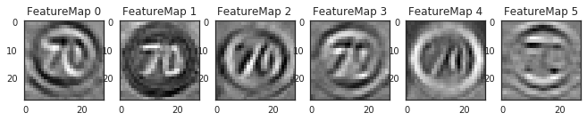

# **Traffic Sign Recognition** 

---

**Build a Traffic Sign Recognition Project**

The goals / steps of this project are the following:
* Load the data set (see below for links to the project data set)
* Explore, summarize and visualize the data set
* Design, train and test a model architecture
* Use the model to make predictions on new images
* Analyze the softmax probabilities of the new images
* Summarize the results with a written report

## Rubric Points
### Here I will consider the [rubric points](https://review.udacity.com/#!/rubrics/481/view) individually and describe how I addressed each point in my implementation.  

---
### Writeup / README

#### 1. Provide a Writeup / README that includes all the rubric points and how you addressed each one. You can submit your writeup as markdown or pdf. You can use this template as a guide for writing the report. The submission includes the project code.

You're reading it! and here is a link to my [project code](https://github.com/sicnarf1a/Self-Driving-Car-P2/blob/master/Traffic_Sign_Classifier.ipynb)

### Data Set Summary & Exploration

#### 1. Provide a basic summary of the data set. In the code, the analysis should be done using python, numpy and/or pandas methods rather than hardcoding results manually.

I used the python library to calculate summary statistics of the traffic
signs data set:
```python
import csv

# Number of training examples
n_train = len(X_train)
# Number of validation examples
n_validation = len(X_valid)
# Number of testing examples.
n_test = len(X_test)
# Shape of an traffic sign image
image_shape = X_train[0].shape
# How many unique classes/labels there are in the dataset.
with open('signnames.csv', 'r') as f:
    traffic_sign = csv.reader(f)
    n_classes = len(list(traffic_sign)) - 1
```
And the results: 
* The size of training set is 34799
* The size of the validation set is 4410
* The size of test set is 12630
* The shape of a traffic sign image is 32x32x3
* The number of unique classes/labels in the data set is 43

#### 2. Include an exploratory visualization of the dataset.

Here is an exploratory visualization of the data set. It is a histogram showing how unbalanced the data set is.

<p align="center">
 <br />
< Histogram of German Traffic Sign Dataset > 
</p>
    
If I need better classification performance(i.e. accuracy), I can handle unbalanced dataset through data augmentation, but I didn't since I could get the enough accuracy.

### Design and Test a Model Architecture

#### 1. Describe how you preprocessed the image data. What techniques were chosen and why did you choose these techniques? Consider including images showing the output of each preprocessing technique. Pre-processing refers to techniques such as converting to grayscale, normalization, etc. (OPTIONAL: As described in the "Stand Out Suggestions" part of the rubric, if you generated additional data for training, describe why you decided to generate additional data, how you generated the data, and provide example images of the additional data. Then describe the characteristics of the augmented training set like number of images in the set, number of images for each class, etc.)

I decided not to convert the images to grayscale because it eventually lose the information the images have.

So, instead of converting the images to grayscale, I decided to normalize the dataset by mean, and standard deviation
through only the training dataset(i.e. not validation, and test dataset).

The code looks like this:
```python
def MeanVarianceNormalizer(X_train, X_valid, X_test):
    o_train = []
    o_valid = []
    o_test = []
    
    statistical_mean = np.full(X_train[0].shape[2], 0)
    statistical_std = np.full(X_train[0].shape[2], 0)
    for i in range(X_train.shape[0]):
        img_train = X_train[i].astype('float32')

        mean = np.mean(np.mean(img_train, axis=0), axis=0)
        std = np.std(np.std(img_train, axis=0), axis=0)

        img_train = (img_train - mean) / std
        o_train.append(img_train)
        
        # get statistical mean and variance through 'only' training dataset
        statistical_mean = statistical_mean + mean
        statistical_std = statistical_std + std
    
    statistical_mean = statistical_mean / X_train.shape[0]
    statistical_std = statistical_std / X_train.shape[0]
    
    for j in range(X_valid.shape[0]):
        img_valid = X_valid[j].astype('float32')
        
        # adjust the statistical mean and variance that are not included in the validation data
        img_valid = (img_valid - statistical_mean) / statistical_std
        o_valid.append(img_valid)
        
    for k in range(X_test.shape[0]):
        img_test = X_test[k].astype('float32')
        
        # adjust the statistical mean and variance that are not included in the test data
        img_test = (img_test - statistical_mean) / statistical_std
        o_test.append(img_test)
    return np.array(o_train), np.array(o_valid), np.array(o_test)
```

Here is an example of an original image and a normalized image:

<p align="center">
 <br />
< Original Image vs Normalized Image >
</p>
    
The difference between the original data and the normalized data is that since the original data is represented by an integer between 0 and 255, the distribution of each pixel value is very diverse (ie, the variance is large) which is a characteristic that makes the learning convergence worse.

However, the normalized data has a narrow distribution with floating point data types, so it is good in terms of learning because the variance is small and the average is zero.


#### 2. Describe what your final model architecture looks like including model type, layers, layer sizes, connectivity, etc.) Consider including a diagram and/or table describing the final model.

My final model was inspired by LeNet, and consisted of the following layers:

| Layer         		|     Description	        					| 
|:---------------------:|:---------------------------------------------:| 
| Input         		| 32x32x3 RGB image   							| 
| Convolution 5x5     	| 1x1 stride, valid padding, outputs 18x18x6 	|
| RELU					|												|
| Max pooling	      	| 2x2 stride,  outputs 9x9x6 				    |
| Convolution 5x5	    | 1x1 stride, valid padding, outputs 5x5x16  	|
| RELU					|												|
| Max pooling	      	| 2x2 stride,  outputs 4x4x16 				    |
| Fully connected		| 400x120, outputs 120x1        		    	|
| Dropout				|												|
| RELU					|												|
| Fully connected		| 120x84, outputs 84x1          		    	|
| Dropout				|												|
| RELU					|												|
| Fully connected		| 84x43, outputs 43x1             		    	|
| Softmax				| return probabilities of 43 classes			|
 


#### 3. Describe how you trained your model. The discussion can include the type of optimizer, the batch size, number of epochs and any hyperparameters such as learning rate.

The network is trained with following characteristics:

* Solver: Adam optimizer,
* Initial learning rate: 0.001,
* Regularization: weight decay(i.e. L2 Regularization) 0.0005,
* Dropout: 0.5,
* Batch size: 128.

Also, I do not use and data augmentation in this network.


#### 4. Describe the approach taken for finding a solution and getting the validation set accuracy to be at least 0.93. Include in the discussion the results on the training, validation and test sets and where in the code these were calculated. Your approach may have been an iterative process, in which case, outline the steps you took to get to the final solution and why you chose those steps. Perhaps your solution involved an already well known implementation or architecture. In this case, discuss why you think the architecture is suitable for the current problem.

My final model results were:
* training set accuracy of 0.999
* validation set accuracy of 0.933
* test set accuracy of 0.920

If a well known architecture was chosen:
* What architecture was chosen?
I choose the network called "LeNet"
* Why did you believe it would be relevant to the traffic sign application?
Since it is well known architecture that fit very well with MNIST which has similar data size to the German Traffic Sign dataset except RGB three channels.
* How does the final model's accuracy on the training, validation and test set provide evidence that the model is working well?
As I have shown above, the training accuracy has almost 99.9% which means not under-fitting. Also, the validation and test accuracy is not far away from the training accuracy, which means not over-fitting.
 

### Test a Model on New Images

#### 1. Choose five German traffic signs found on the web and provide them in the report. For each image, discuss what quality or qualities might be difficult to classify.

Here are five German traffic signs that I found on the web:

<p align="center">
 <br />
< Web Image 1, Label: 25, Sign: Road work >
 
<p align="center">
 <br />
< Web Image 2, Label: 4, Sign: Speed limit (70km/h) >
    
<p align="center">    
 <br />
< Web Image 3, Label: 1, Sign: Speed limit (30km/h) >
    
<p align="center">    
 <br />
< Web Image 4, Label: 27, Sign: Pedestrians >
    
<p align="center">    
 <br />
< Web Image 5, Label: 23, Sign: Slippery road >
    
These five pictures arbitrary have different sizes, so I should cropping and resizing.
Here's the code:
```python
# preprocessing arbitrary size of images to fit my model
def preprocess(image):
    w, l = image.shape[0], image.shape[1]
    min_ = min(w, l)
    # cropping by shorter width, or length
    if w > min_:
        crop_size = w - min_
        crop_img = image[int(crop_size/2):int(crop_size/2)+min_, :]
    else:
        crop_size = l - min_
        crop_img = image[:, int(crop_size/2):int(crop_size/2)+min_]
        
    # resize the cropped image by (32,32,3)
    img = cv2.resize(crop_img, (32, 32))
    
    img = img.astype('float32')
    # adjust the statistical mean and variance
    img = (img - statistical_mean) / statistical_std
    # expand dimension for tensorflow batch-like operation
    img = np.expand_dims(img, axis=0)
    return img
```

Downsizing the image means that it was not easy to get good performance because of resolution problem.

#### 2. Discuss the model's predictions on these new traffic signs and compare the results to predicting on the test set. At a minimum, discuss what the predictions were, the accuracy on these new predictions, and compare the accuracy to the accuracy on the test set (OPTIONAL: Discuss the results in more detail as described in the "Stand Out Suggestions" part of the rubric).

Here are the results of the prediction:

| Image			        |     Prediction	        					| 
|:---------------------:|:---------------------------------------------:| 
| Road work      		| Road work   									| 
| Speed limit (70km/h)  | Speed limit (70km/h) 							|
| Speed limit (30km/h)	| Speed limit (30km/h)							|
| Pedestrians	   		| BGeneral caution				 				|
| Slippery Road			| Slippery Road      							|

The model was able to correctly guess 4 of the 5 traffic signs, which gives an accuracy of 80%. This compares favorably to the accuracy on the test set of 92%.

#### 3. Describe how certain the model is when predicting on each of the five new images by looking at the softmax probabilities for each prediction. Provide the top 5 softmax probabilities for each image along with the sign type of each probability. (OPTIONAL: as described in the "Stand Out Suggestions" part of the rubric, visualizations can also be provided such as bar charts)
       
The code for making predictions on my final model is located in the 34th cell of the Ipython notebook.

For the first image, the model is concretly sure that this is a "Road work" (probability of 0.9), and the image does contain a "Road work". The top five soft max probabilities were

| Probability         	|     Prediction	        					| 
|:---------------------:|:---------------------------------------------:| 
| .999         			| Road work   									| 
| .001     				| Wild animals crossing 						|
| .000					| Bumpy road									|
| .000	      			| Bicycles crossing				 				|
| .000				    | Dangerous curve to the right      			|

        
For the second image the model is also concretly sure that this is a "Speed limit (70km/h)"" (probability of 0.9), and the image does contain a "Speed limit (70km/h)"". The top five soft max probabilities were

| Probability         	|     Prediction	        					| 
|:---------------------:|:---------------------------------------------:| 
| .997         			| Speed limit (70km/h)   						|
| .002     				| Stop 			    							|
| .001					| Speed limit (20km/h)							|
| .000	      			| Yield     					 				|
| .000				    | Keep right          							|


For the third image the model is also concretly sure that this is a "Speed limit (30km/h)" (probability of 0.9), and the image does contain a "Speed limit (30km/h)". The top five soft max probabilities were

| Probability         	|     Prediction	        					| 
|:---------------------:|:---------------------------------------------:| 
| .994         			| Speed limit (30km/h)							| 
| .005     				| Speed limit (50km/h)							|
| .001					| Speed limit (70km/h)							|
| .000	      			| Speed limit (20km/h)				 			|
| .000				    | End of speed limit (80km/h)   				|


Sadly, for the fourth image the model is concretly sure that this is a "General caution" (probability of 0.9), and the image does contain a "Pedestrians". The top five soft max probabilities were

| Probability         	|     Prediction	        					| 
|:---------------------:|:---------------------------------------------:| 
| .999         			| General caution								| 
| .001     				| Traffic signals						    	|
| .000					| Pedestrians					        		|
| .000	      			| Right-of-way at the next intersection		 	|
| .000				    | Road narrows on the right 					|

        
For the fifth image the model is relatively sure that this is a "Slippery road" (probability of 0.62), and the image does contain a "Slippery road". The top five soft max probabilities were

| Probability         	|     Prediction	        					| 
|:---------------------:|:---------------------------------------------:| 
| .621         			| Slippery road     							| 
| .323     				| Keep left						                |
| .045					| Speed limit (60km/h)				    		|
| .009	      			| Speed limit (80km/h)		 		    		|
| .001				    | Dangerous curve to the right					|


### (Optional) Visualizing the Neural Network (See Step 4 of the Ipython notebook for more details)
#### 1. Discuss the visual output of your trained network's feature maps. What characteristics did the neural network use to make classifications?

<p align="center">
 <br />
< First Convolution Layer Activation Feature Map >
</p>
    
This figure shows the activation feature map for the first convolution layer.

As shown in the figure, the number 70 seems to stand out from the background. It means that the convolution operation can be regarded as extracting the feature of number 70 from the picture.
 

